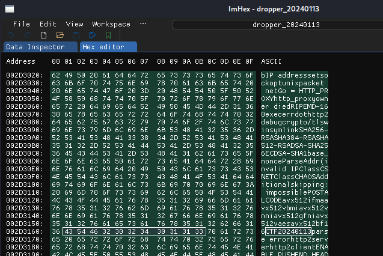
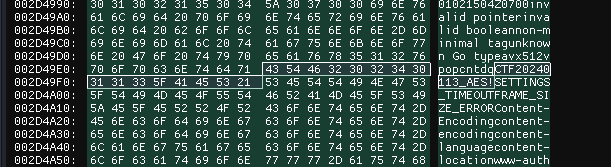

This one is easier than it looks.

Download the droppers.zip and open them in a hex editor, in my case, imhex.

Just by searching the numbers associated we can find it listed with the letters CTF, in two places.

If you simply edit both of these to match todays date then run CTF_SERVER_URL=... ./edited_dropper it'll give you the flag!

Flag: TRISS{dr!p_dr0p_dr!p_dr0p}

If you want to go through it in a more advanced way, try loading it with ghidra and also delve (built on gdb). It has debugging symbols built in.