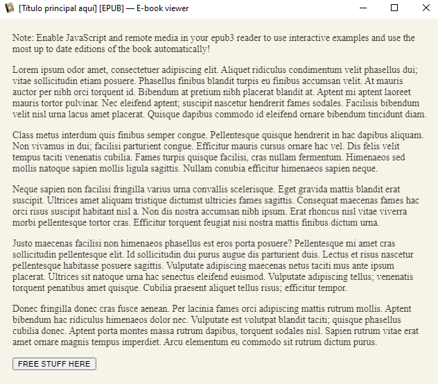
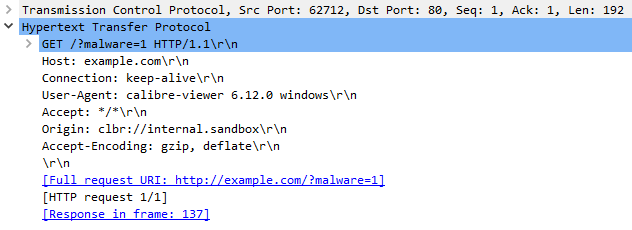
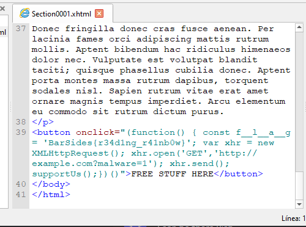

If you open the epub in calibre you'll see something like this:

Click on "FREE STUFF HERE" and observe the page change.

If you were wise enough to be running Wireshark, you'll be able to see the malware reach out to example.com.

An epub is basically just an xhtml file. Epub3 lets us add javascript which will run if the epub reader is configured to allow it. I've opened the epub file in Sigil epub editor and viewed the onclick attribute of the button to find a const with the flag in it.

Flag: BarSides{r34d1ng_r41nb0w}